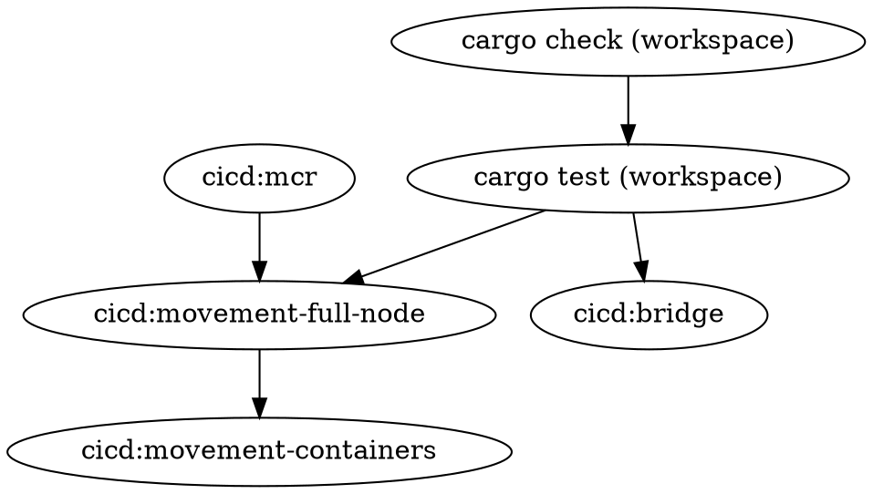

# Pipeline
We intend to rely on our CI/CD pipeline to validate software correctness. 

This primarily runs in GitHub Actions and uses a tag-based solution to minimize machine use. PRs opt into running certain workflows by tagging the PR. The workflow will run on the tag event and so PRs must be retagged. 

This places an extra onus on CODEOWNERS to ensure that PRs are properly tagged and the needed checks are run. 

Generally, before merging to main, the PR should have run all the tests. However, beforehand, the PR may opt into running only the tests that are relevant to the changes.

To help guide the relevant code-owners, we maintain the following graph of dependencies (in DOT syntax). An edge from A to B indicates that B should not pass if A fails, i.e., you can assume the checks in B will not be satisfied if you have not yet passed the checks in A.

To render this graph, you can visit [WebGraphViz](http://www.webgraphviz.com/) and paste the above program into the text box.
