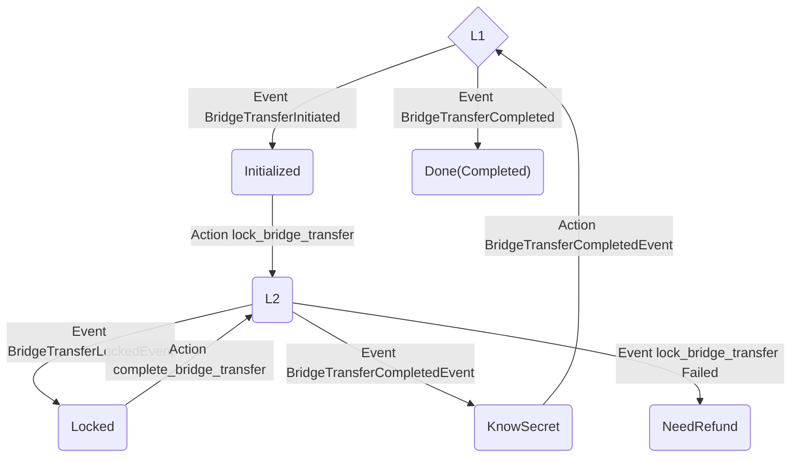
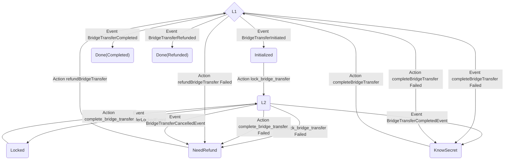
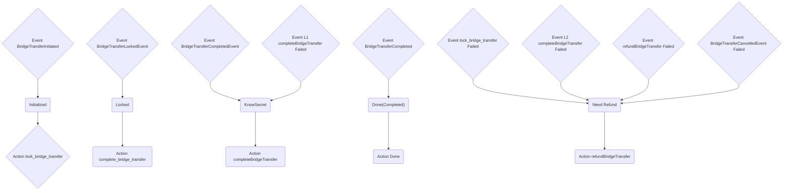

# Bridge transfer state logic definition

## Normal transfer process state changes

```mermaid
flowchart TB
    L1{"L1"} --Event BridgeTransferInitiated--> B("Initialized")
    B --Action lock_bridge_transfer--> L2("L2")
    L2 --Event BridgeTransferLockedEvent--> C("Locked")
    C --Action complete_bridge_transfer--> L2
    L2 --Event BridgeTransferCompletedEvent--> D("KnowSecret")
    D -- Action BridgeTransferCompletedEvent --> L1
    L1 -- Event BridgeTransferCompleted --> E("Done(Completed)")
    L2 -- Event lock_bridge_transfer Failed --> F("NeedRefund")
  
```

## State changes with error cases

```mermaid
flowchart TB
    L1{"L1"} --Event BridgeTransferInitiated--> B("Initialized")
    B --Action lock_bridge_transfer--> L2("L2")
    L2 --Event BridgeTransferLockedEvent--> C("Locked")
    C --Action complete_bridge_transfer--> L2
    L2 --Event BridgeTransferCompletedEvent--> D("KnowSecret")
    D --Action completeBridgeTransfer--> L1
    L1 --Event BridgeTransferCompleted--> G1("Done(Completed)")

    L2 --"Action lock_bridge_transfer Failed"--> F("NeedRefund")
    F --"Action refundBridgeTransfer"--> L1
    L1 --"Event BridgeTransferRefunded"--> G2("Done(Refunded)")
  	L2 --"Action complete_bridge_transfer Failed"--> F
    L1 --"Event completeBridgeTransfer Failed"--> D
    L1 --"Action refundBridgeTransfer Failed"--> F
    L1 -- Action completeBridgeTransfer Failed --> D

   	L2 --"Event BridgeTransferCancelledEvent"--> F

```

## Event / Actions of all states

```mermaid
flowchart TB
 
  BE{"Event BridgeTransferInitiated"}-->BB("Initialized")
  BB -->BA{"Action lock_bridge_transfer"}

  CE{"Event BridgeTransferLockedEvent"}-->CC("Locked")
  CC -->CA("Action complete_bridge_transfer")
 
  DE{"Event BridgeTransferCompletedEvent"}-->DD("KnowSecret")
  DD -->DA("Action completeBridgeTransfer")
  DDE{"Event L1 completeBridgeTransfer Failed"}-->DD

  EE{"Event BridgeTransferCompleted"}-->EEE("Done(Completed)")
  EEE -->EA("Action Done")


  FE{"Event lock_bridge_transfer Failed"}-->FF(""Need Refund"")
  FF -->FA("Action refundBridgeTransfer")

  GE{"Event L2 completeBridgeTransfer Failed"}-->FF
  HE{"Event refundBridgeTransfer Failed"}-->FF
  IE{"Event BridgeTransferCancelledEvent Failed"}-->FF

 
```