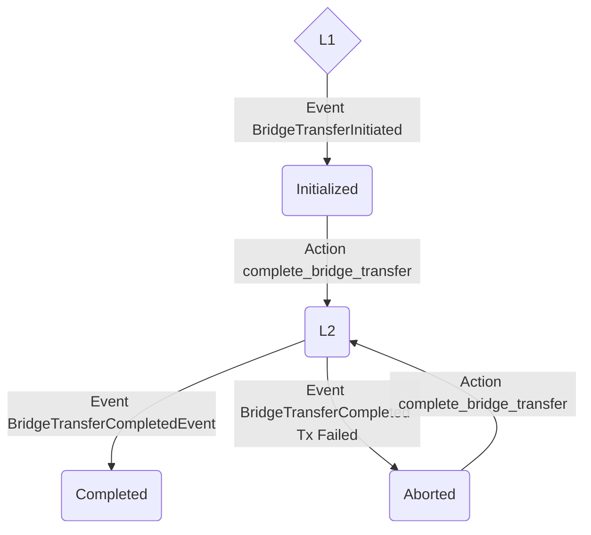
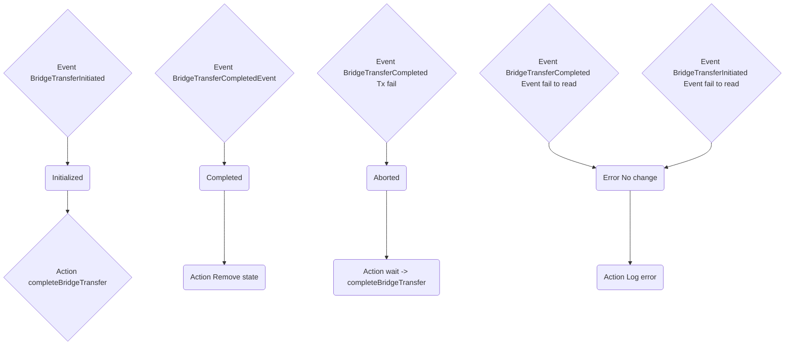

# Bridge transfer state logic definition

## Transfer process state changes

```mermaid
flowchart TB
    L1{"L1"} --Event BridgeTransferInitiated--> B("Initialized")
    B --Action complete_bridge_transfer--> L2("L2")
    L2 --Event BridgeTransferCompletedEvent--> C("Completed")
    L2 -- Event BridgeTransferCompleted Tx Failed --> D("Aborted")
    D --Action complete_bridge_transfer--> L2("L2")
  
```

## Event / Actions of all states

```mermaid
flowchart TB

  BE{"Event BridgeTransferInitiated"}-->BB("Initialized")
  BB -->BA{"Action completeBridgeTransfer"}

  CE{"Event BridgeTransferCompletedEvent"}-->CC("Completed")
  CC -->CA("Action Remove state")
 
  DE{"Event BridgeTransferCompleted Tx fail"}-->DD("Aborted")
  DD -->DA("Action wait -> completeBridgeTransfer")

  EE{"Event BridgeTransferCompleted Event fail to read"}-->EEE("Error No change")
  EEE -->EA("Action Log error")
  FE{"Event BridgeTransferInitiated Event fail to read"}-->EEE("Error No change")
 
```