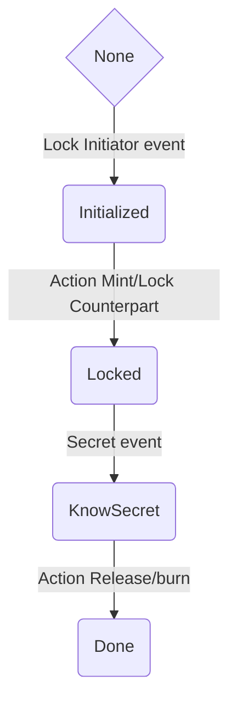
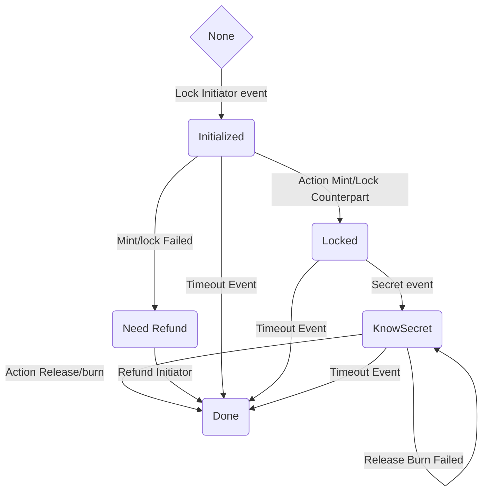
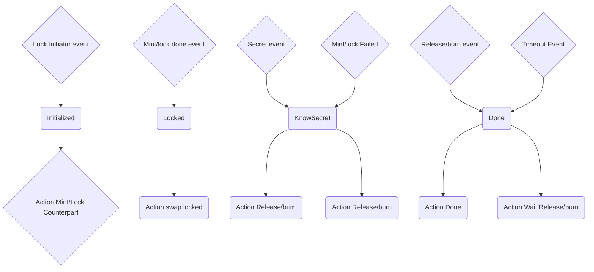

# Bridge swap state logic definition

## Normal swap process state changes

```mermaid
flowchart TB
    A{"None"} --Lock Initiator event--> B("Initialized")
    B --Action Mint/Lock Counterpart--> C("Locked")
    C -- Secret event --> D("KnowSecret")
    D -- Action Release/burn --> E("Done")
  
```

## State changes with error cases

```mermaid
flowchart TB
    A{"None"} --Lock Initiator event--> B("Initialized")
    B --Action Mint/Lock Counterpart--> C("Locked")
    C -- Secret event --> D("KnowSecret")
    D -- Action Release/burn --> E("Done")

    B --"Mint/lock Failed"--> F("Need Refund")
    F --"Refund Initiator"--> E("Done")

    D --"Release Burn Failed"--> D

    B --"Timeout Event"--> E
    C --"Timeout Event"--> E
    D --"Timeout Event"--> E

```

## Event / Actions of all state

```mermaid
flowchart TB
 
  BE{"Lock Initiator event"}-->BB("Initialized")
  BB -->BA{"Action Mint/Lock Counterpart"}

  CE{"Mint/lock done event"}-->CC("Locked")
  CC -->CA("Action swap locked")
 
  DE{"Secret event"}-->DD("KnowSecret")
  DD -->DA("Action Release/burn")

  DDE{"Mint/lock Failed"}-->DD("KnowSecret")
  DD -->DDA("Action Release/burn")
 
  EE{"Release/burn event"}-->EEE("Done")
  EEE -->EA("Action Done")

  FE{"Timeout Event"}-->EEE
  EEE -->FA("Action Wait Release/burn")

```